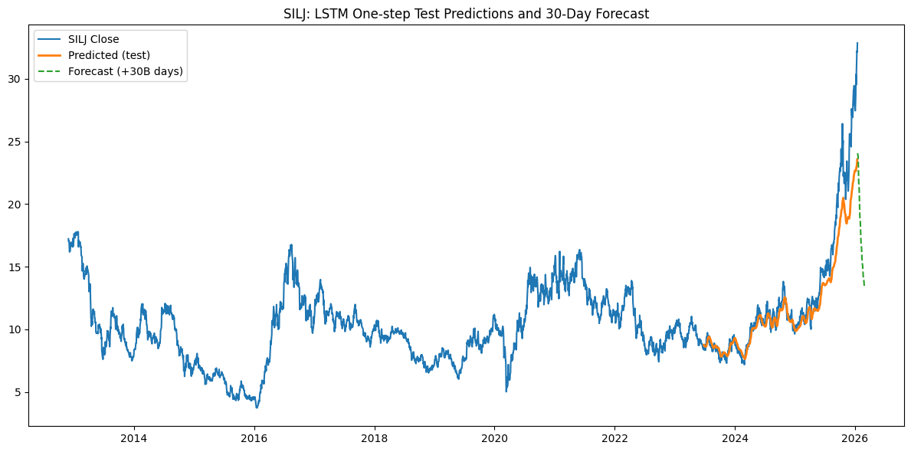

# LSTM Stock Price Prediction Model

LSTM-based stock price forecasting model built in Python using TensorFlow. The project uses daily historical price data, a chronological train-test split, train-only scaling, and a 30-business-day forward forecast.

## Overview

This project applies a Long Short-Term Memory (LSTM) neural network to predict daily stock prices from historical time series data.

The model was designed with a proper time-series workflow:
- chronological train-test split
- MinMax scaling fit on training data only
- early stopping to reduce overfitting
- hold-out evaluation using RMSE
- iterative 30-business-day forward forecast

## Objective

The goal was to test whether an LSTM model could capture short-term patterns in daily stock prices and generate reasonable out-of-sample predictions.

## Model Setup

- Ticker: SILJ
- Data period: 2012-01-01 to 2026-01-16
- Time step: 100 days
- Train ratio: 80%
- Forecast horizon: 30 business days
- Architecture:
  - LSTM(64, return_sequences=True)
  - LSTM(64)
  - Dense(64, activation="relu")
  - Dense(1)

## Methodology

1. Download daily close price data using `yfinance`
2. Create rolling windows of 100 observations
3. Fit the scaler on the training portion only
4. Split the data chronologically into train and test sets
5. Train the LSTM model using early stopping
6. Evaluate test-set predictions using RMSE
7. Generate a 30-business-day forward forecast recursively

## Result

- Hold-out test RMSE: 6.59

The chart shows:
- actual close prices
- predicted prices on the test set
- 30-business-day forward forecast



## Key Skills Demonstrated

- Python
- TensorFlow / Keras
- Time-series modelling
- Data preprocessing
- Model evaluation
- Financial data analysis

## Files

- `lstm_stock_prediction.py`
- `silj_lstm_forecast.png`
- `requirements.txt`

## Notebook

GitHub notebook version: `lstm_stock_prediction.ipynb`  
Google Colab version: [Open in Colab](https://colab.research.google.com/drive/16BWO6tzb_NitOA6XJkGold2hwz_Ydf7B?usp=sharing)
## How to Run

1. Install dependencies:

```bash
pip install numpy pandas yfinance scikit-learn tensorflow matplotlib
```

## Author

Gwïon Rhys Owen
